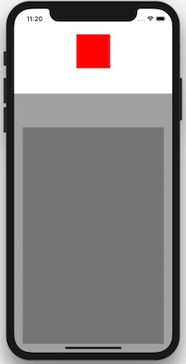

**Layoutable** is an extension for UIView apps that make use of Auto Layout easier.
This framework doesn't replace any existing Auto Layout API available in UIKit. Anchor API is very good
and easy to use, but sometimes require a lot of code repetition for common tasks. This framework only adds a couple of useful extensions. You can check the implementation in just [one single file](https://github.com/MichalTKwiecien/Layoutable/blob/master/Layoutable/UIView%2BLayoutable.swift).

## Usage & features

<p align="center">
  
</p>

Here's how the code would look like when constraining the screen above. See the [example](https://github.com/MichalTKwiecien/Layoutable/blob/master/Example/ViewController.swift) for the full version.

### Just UIKit

```swift
import UIKit

final class ViewController: UIViewController {

    private let headerView: UIView = {
        let view = UIView()
        view.backgroundColor = .white
        view.translatesAutoresizingMaskIntoConstraints = false
        return view
    }()

    [...]

    override func loadView() {
        [...]

        NSLayoutConstraint.activate([
            headerView.topAnchor.constraint(equalTo: view.topAnchor),
            headerView.leftAnchor.constraint(equalTo: view.leftAnchor),
            headerView.rightAnchor.constraint(equalTo: view.rightAnchor),
            headerView.heightAnchor.constraint(equalToConstant: 200),

            headerCenterView.widthAnchor.constraint(equalToConstant: 80),
            headerCenterView.heightAnchor.constraint(equalToConstant: 80),
            headerCenterView.centerXAnchor.constraint(equalTo: headerView.centerXAnchor),
            headerCenterView.centerYAnchor.constraint(equalTo: headerView.centerYAnchor),

            contentContainerView.topAnchor.constraint(equalTo: headerView.bottomAnchor),
            contentContainerView.leftAnchor.constraint(equalTo: view.leftAnchor),
            contentContainerView.rightAnchor.constraint(equalTo: view.rightAnchor),
            contentContainerView.bottomAnchor.constraint(equalTo: view.bottomAnchor),

            contentView.topAnchor.constraint(equalTo: contentContainerView.topAnchor, constant: 80),
            contentView.leftAnchor.constraint(equalTo: contentContainerView.leftAnchor, constant: 20),
            contentView.rightAnchor.constraint(equalTo: contentContainerView.rightAnchor, constant: -20),
            contentView.bottomAnchor.constraint(equalTo: contentContainerView.bottomAnchor, constant: -20),
        ])
    }
}
```

### UIKit + Layoutable

```swift
import UIKit
import Layoutable

final class ViewController: UIViewController {

    private let headerView: UIView = {
        let view = UIView()
        view.backgroundColor = .white
        return view.layoutable()
    }()

    [...]

    override func loadView() {
        [...]

        headerView.constrainToSuperviewEdges(excluding: [.bottom])
        headerView.heightAnchor.constraint(equalToConstant: 200).isActive = true

        headerCenterView.constrainToConstant(size: .init(width: 80, height: 80))
        headerCenterView.constrainCenterToSuperview()

        contentContainerView.constrainToSuperviewEdges(excluding: [.top])
        contentContainerView.topAnchor.constraint(equalTo: headerView.bottomAnchor).isActive = true

        contentView.constrainToSuperviewEdges(insets: .init(top: 80, left: 20, bottom: 20, right: 20))
    }
}
```

### Detecting if view can be used with Auto Layout
For all of the views that you want to use with Auto Layout you have to type
`translatesAutoresizingMaskIntoConstraints = false`.
It's very easy to forget and have a lot of conflicts after running your app.
Layoutable checks for this situation and informs you how to fix it.

## Requirements

Layoutable supports **iOS 9.0 or higher**.

## Installation

### Carthage

If you're using [Carthage](https://github.com/Carthage/Carthage), add the following dependency to your `Cartfile`:

```ruby
github "MichalTKwiecien/Layoutable" {version}
```

### CocoaPods

If you're using [CocoaPods](http://cocoapods.org), add the following dependency to your `Podfile`:

```ruby
pod 'Layoutable', '~> {version}'
```

### Manually

You can just drag and drop [single file](https://github.com/MichalTKwiecien/Layoutable/blob/master/Layoutable/UIView%2BLayoutable.swift) to your project.

## Contributing

Development requires following tools:

- **[Xcode](https://developer.apple.com/xcode/) 9.4** with **Swift 4.1**,
- **[Carthage](https://github.com/Carthage/Carthage) 0.3** or higher.

After cloning the repository, install project's dependencies:

```sh
$ carthage bootstrap --platform iOS
```
